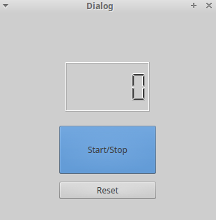

timer
====

#Description
ラーメンタイマー

#Requirement
-Python 2.7.x
-PySide

#Usage
##'$ python main1.py'

#Insyall
以下のコマンドで任意のディレクトリにcloneしてください。
'$ git clone git github.com:Kawasakis/timer.git'
または任意のディレクトリにzipファイルをダウンロードして解凍してください。

#Author
[Kawasakis](http://github.com/Kawasakis)
